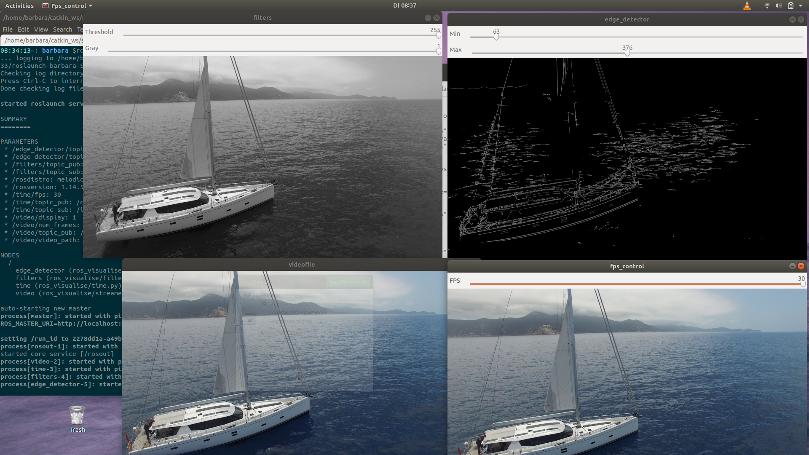
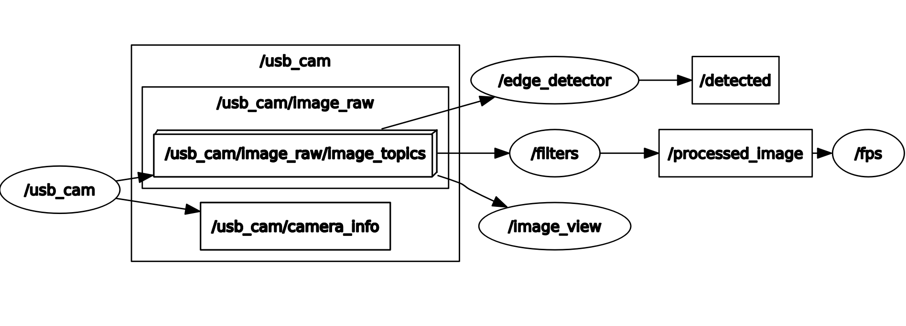
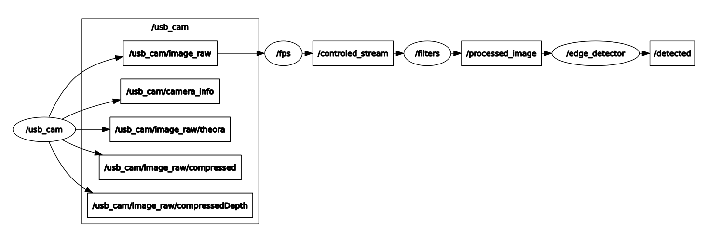
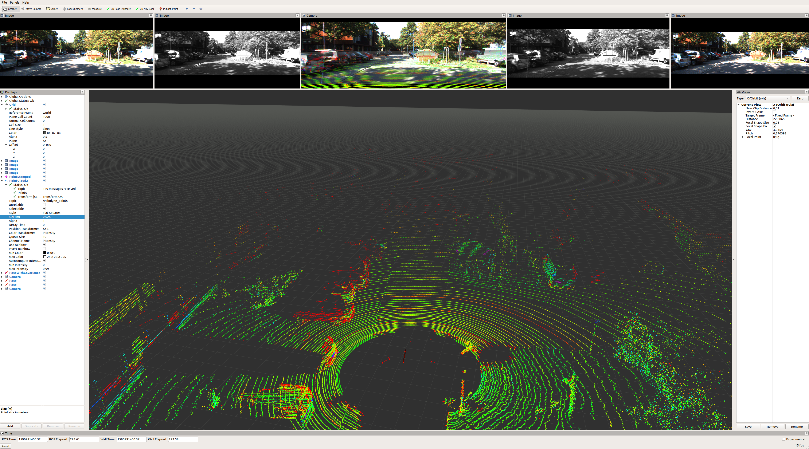
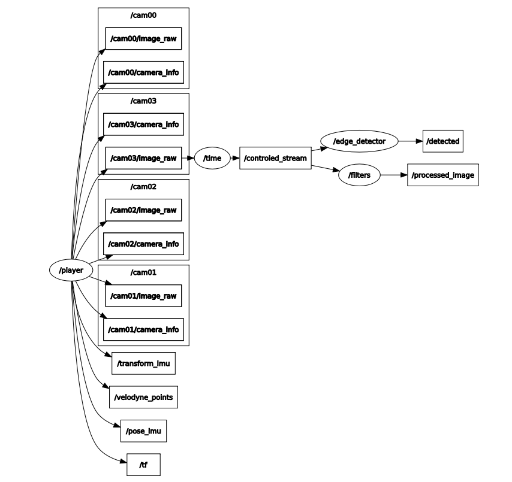

# Project: Localization and detection of landmarks for supporting UAV navigation

Bachelor semester project 2 : part I

## Visualizing data with ROS

1. install ROS, understanding topic, publishers and subscribers

2. Rviz tool with http://www.cvlibs.net/datasets/kitti/raw_data.php

3. Implement nodes from prerecorded rosbag containing images, localization and other sensor data and display nodes in a more advanced way.

## Ros


          

### Install this repository:
```
cd ~/catkin_ws/src

git clone https://github.com/BarbaraMMCS/UAV_navigation_ROS.git

cd ~/catkin_ws/

catkin_make

```
### Packages: 

vision_opencv : http://wiki.ros.org/vision_opencv

usb_cam : http://wiki.ros.org/usb_cam

kitti_to_rosbag : https://github.com/ethz-asl/kitti_to_rosbag

## Launch package ros_visualise:

### from video file: 

```
roslaunch ros_visualise main_video.launch
```



### from camera raw file:

```
roslaunch ros_visualise main_usb_cam.launch
```
```
rosrun rviz rviz -d `rospack find ros_visualise`/rviz/image.rviz
```



### from from rosbag (kitty dataset): 
```
http://www.cvlibs.net/datasets/kitti/index.php
```
```
roslaunch ros_visualise time_rosbag.launch
```
```
rosrun rviz rviz -d `rospack find ros_visualise`/rviz/kitti.rviz
```




