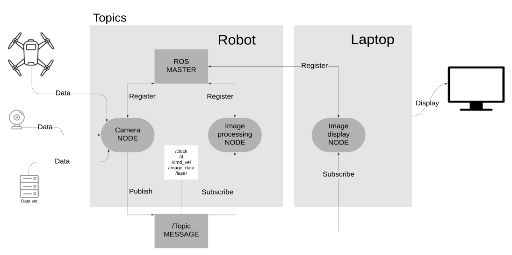
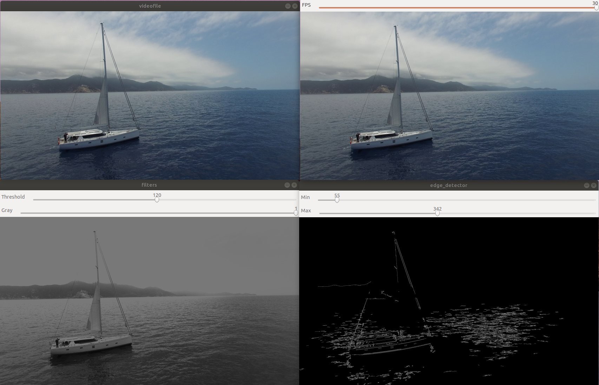
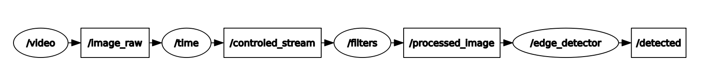
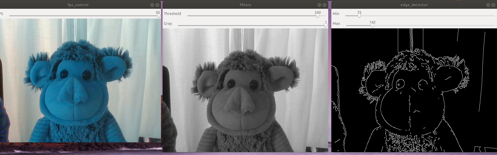
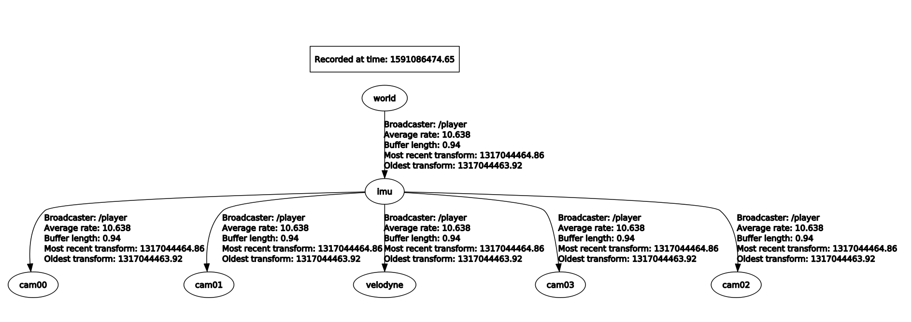
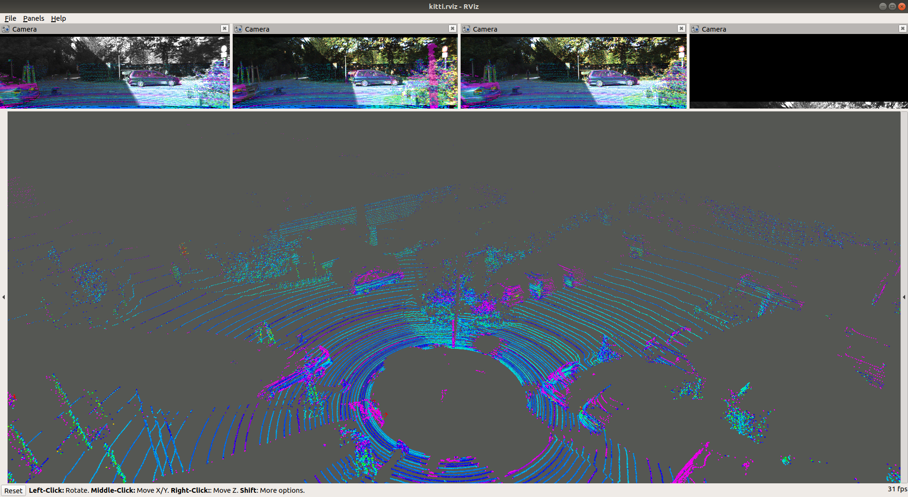
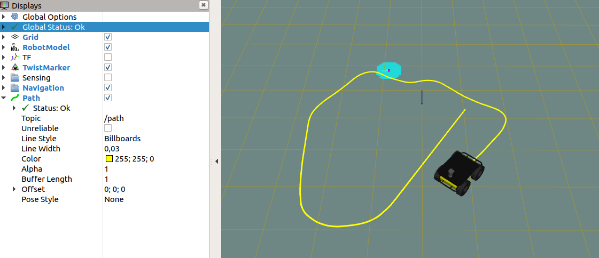
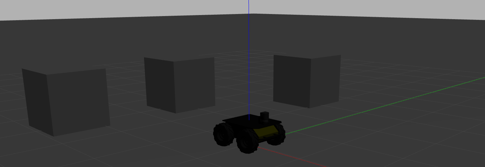

# Project: Localization and detection of landmarks for supporting UAV navigation

Bachelor semester project 2 : part I

## Visualizing data with ROS

1. install ROS, understanding topic, publishers and subscribers

2. Rviz tool with http://www.cvlibs.net/datasets/kitti/raw_data.php

3. Implement nodes from prerecorded rosbag containing images, localization and other sensor data and display nodes in a more advanced way.

## Ros:


    
### Install this repository:
```
cd ~/catkin_ws/src

git clone https://github.com/BarbaraMMCS/UAV_navigation_ROS.git

cd ~/catkin_ws/

catkin_make
```
### Packages: 

vision_opencv : http://wiki.ros.org/vision_opencv

usb_cam : http://wiki.ros.org/usb_cam

kitti_to_rosbag : https://github.com/ethz-asl/kitti_to_rosbag

Husky robot:
```
sudo apt-get install ros-melodic-husky-simulator ros-melodic-husky-navigation ros-melodic-husky-gazebo ros-melodic-husky-viz

export HUSKY_GAZEBO_DESCRIPTION=$(rospack find husky_gazebo)/urdf/description.gazebo.xacro
```

## Launch package:

### From video (drone file): 
```
roslaunch ros_visualise main_video.launch
```



### From camera device (webcam):
```
roslaunch ros_visualise main_usb_cam.launch
```



### From rosbag (kitti dataset): 
```
roslaunch ros_visualise main_rosbag.launch
```




### Navigation (Husky robot)
http://wiki.ros.org/Robots/Husky
```
roslaunch ros_visualise main_path.launch
```




