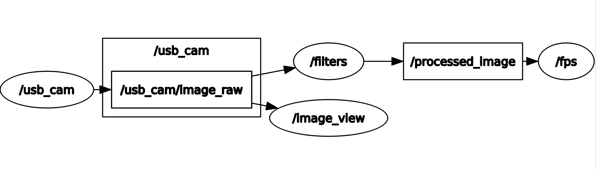
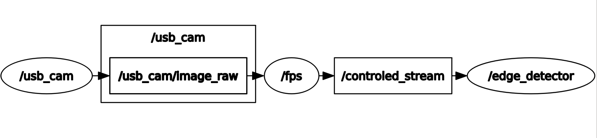
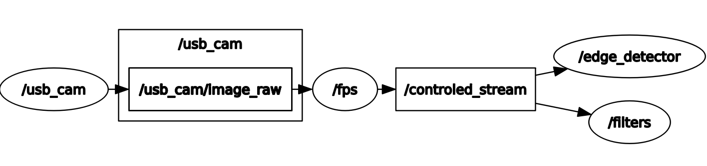
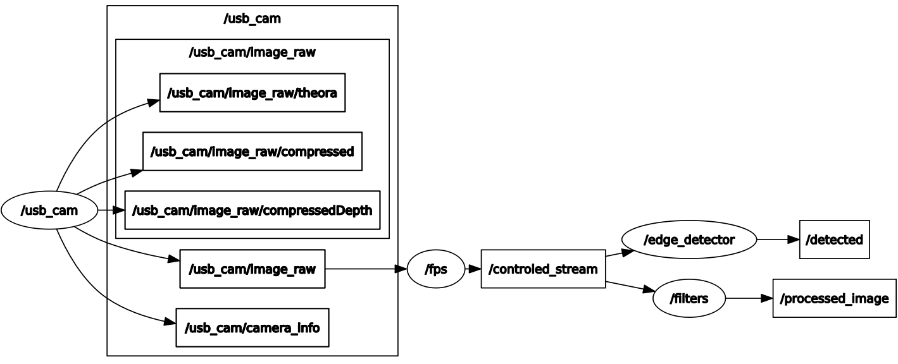
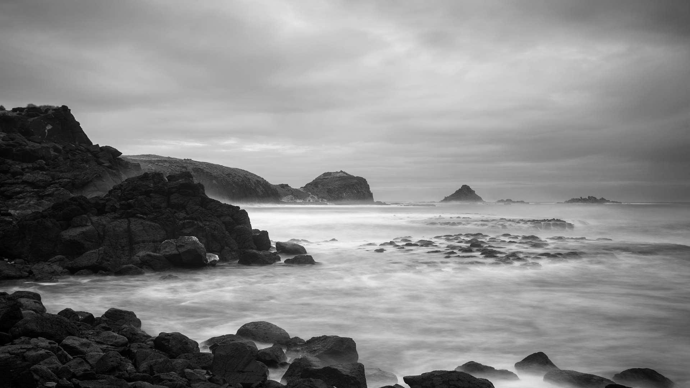

# Project : Localization and detection of landmarks for supporting UAV navigation

Bachelor semester project 2 : part I

## Visualizing data with ROS

1. install ROS, understanding topic, publishers and subscribers

2. Rviz tool with http://www.cvlibs.net/datasets/kitti/raw_data.php

3. Implement nodes from prerecorded rosbag containing images, localization and other sensor data and display nodes in a more advanced way.

## Ros


          
### Install workspace

### Install this repository :
```
cd ~/catkin_ws/src

git clone https://github.com/BarbaraMMCS/UAV_navigation_ROS.git

cd ~/catkin_ws/

catkin_make

```
### Packages: 

vision_opencv : http://wiki.ros.org/vision_opencv

usb_cam : http://wiki.ros.org/usb_cam

### Launch:
```
roslaunch ros_visualise main.launch
```
```
roslaunch ros_edge_detector main.launch
```
```
roslaunch ros_fps time.launch
```
### ros_visualise:


```
rosrun rviz rviz -d `rospack find ros_visualise`/rviz/image.rviz
```


### ros_edge_detector:






## Kitty data set: 
```
http://www.cvlibs.net/datasets/kitti/index.php
```


```
rosrun rviz rviz -d `rospack find ros_visualise`/rviz/kitti.rviz
```




